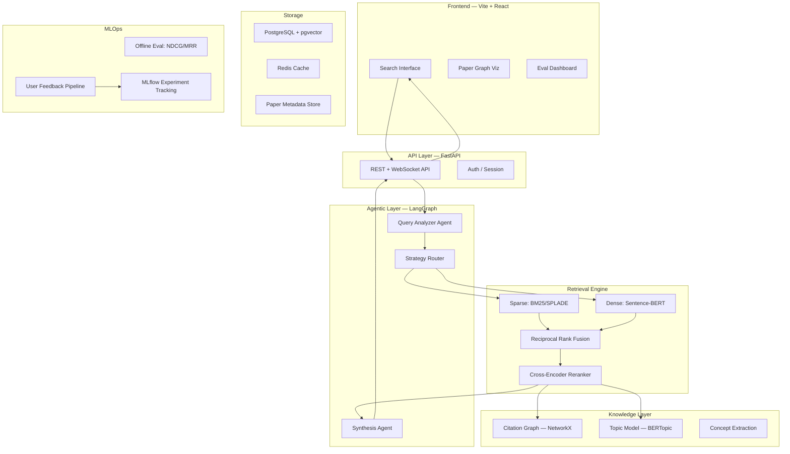
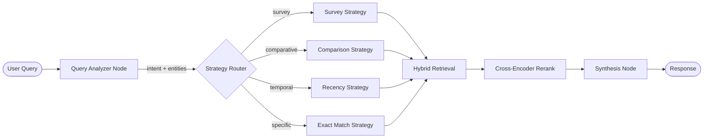

# 🧠 ScholarMind — Semantic Research Paper Recommender

> An AI-native research discovery engine with hybrid retrieval, agentic query routing, citation-graph intelligence, and personalized recommendations across 35K+ arXiv papers.

---

## 1. Project Vision

Build a system that doesn't just "search papers" — it **understands research intent**, **reasons over the knowledge graph of science**, and **learns from user behavior** to surface the most relevant papers. This is not a toy RAG demo; it's an end-to-end ML system with proper evaluation, feedback loops, and production engineering.

---

## 2. High-Level Architecture



---

## 3. Tech Stack

| Layer | Technology | Why |
|-------|-----------|-----|
| **Backend** | FastAPI | Async, type-safe, auto-docs — production standard |
| **Agent Orchestration** | LangGraph | Stateful multi-step agent graphs, industry standard |
| **LLM** | Gemini 2.0 Flash | Fast, cheap, great for query expansion & summarization |
| **Dense Embeddings** | `all-MiniLM-L6-v2` or `BAAI/bge-base-en-v1.5` | Best quality/speed tradeoff for semantic search |
| **Sparse Retrieval** | `rank_bm25` (Python) | Lightweight, no infra dependency |
| **Cross-Encoder** | `cross-encoder/ms-marco-MiniLM-L-6-v2` | Re-ranking SOTA, small enough to run on CPU |
| **Vector DB** | PostgreSQL + pgvector | One DB for everything — vectors + metadata + relations |
| **Cache** | Redis | Sub-ms query caching, session store |
| **Topic Modeling** | BERTopic | Neural topic modeling, great for paper clustering |
| **Graph Analysis** | NetworkX | Citation graph traversal, PageRank, community detection |
| **Experiment Tracking** | MLflow | Track retrieval experiments, model versions |
| **Frontend** | Vite + React + D3.js | Modern, fast, interactive graph visualizations |
| **Containerization** | Docker Compose | One-command local setup |

---

## 4. Feature Breakdown — The Deep Dive

---

### Feature 1: Intelligent Data Ingestion Pipeline

#### What
A robust pipeline that downloads, parses, chunks, and indexes arXiv papers — not naively, but with **section-aware parsing** that understands paper structure.

#### Why
Most projects do naive fixed-size chunking (split every 500 tokens). This destroys context boundaries — a chunk might contain half of "Methods" and half of "Results." Section-aware chunking preserves semantic units, leading to dramatically better retrieval quality.

#### How
1. **Data Source**: Use the [arXiv Bulk Data API](https://info.arxiv.org/help/bulk_data.html) or Kaggle's arXiv dataset (~2M papers metadata, we filter to 35-50K in target domains like CS.AI, CS.CL, CS.LG).
2. **Metadata Extraction**: Parse title, abstract, authors, categories, publication date, citation IDs.
3. **Section-Aware Chunking**:
   - Parse abstracts as standalone chunks (highest signal-density section).
   - For full-text papers (where available via LaTeX source): use regex/heuristics to detect `\section{}` boundaries and chunk per-section.
   - Each chunk gets metadata: `{paper_id, section_type, chunk_index, authors, date, categories}`.
4. **Embedding Generation**: Batch-encode all chunks using Sentence-BERT. Store vectors in pgvector.
5. **BM25 Index**: Build an in-memory BM25 index over the same chunks for sparse retrieval.
6. **Incremental Updates**: A scheduled job (daily/weekly) that fetches new papers and indexes them without rebuilding everything.

#### Technical Details
```
Chunk Schema:
- id: UUID
- paper_id: str (arXiv ID)
- section: enum (ABSTRACT, INTRO, METHOD, RESULTS, CONCLUSION, FULL)
- text: str
- embedding: vector(384)  # for MiniLM
- bm25_tokens: list[str]  # pre-tokenized for BM25
- metadata: jsonb {authors, date, categories, citation_count}
```

---

### Feature 2: Hybrid Retrieval with Reciprocal Rank Fusion (RRF)

#### What
Combine **sparse retrieval** (BM25 — keyword matching) and **dense retrieval** (vector similarity — semantic matching) using Reciprocal Rank Fusion to get the best of both worlds.

#### Why
Dense retrieval excels at semantic similarity ("papers about attention mechanisms" → finds transformer papers) but fails on exact terms ("ResNet-152 benchmark on ImageNet"). BM25 is the opposite. Hybrid retrieval with RRF is used by **Elasticsearch 8+, Pinecone, Weaviate** — it's the industry standard, not an academic experiment.

#### How
1. **Parallel Retrieval**: For each query, fire both BM25 and dense search simultaneously.
   - BM25: Return top-50 candidates ranked by BM25 score
   - Dense: Return top-50 candidates ranked by cosine similarity
2. **Reciprocal Rank Fusion**:
   ```
   RRF_score(doc) = Σ 1 / (k + rank_i(doc))
   ```
   Where `k=60` (standard), and `rank_i` is the rank from retrieval system `i`. This elegantly merges two ranked lists without needing score normalization.
3. **Output**: Top-20 fused candidates passed to the reranker.

#### Why RRF Over Other Fusion Methods?
- **Score normalization** (min-max, z-score) is fragile — BM25 and cosine scores have different distributions.
- **Learned fusion** (weighted combination) requires training data you don't have initially.
- **RRF is parameter-free** (only `k`) and empirically outperforms both individual systems.

---

### Feature 3: Cross-Encoder Reranking

#### What
A second-stage model that takes `(query, document)` pairs and produces a relevance score using full cross-attention — much more accurate than bi-encoder similarity.

#### Why
Bi-encoders (Sentence-BERT) encode query and document **independently**, then compare with cosine similarity. This is fast but lossy — it can't capture fine-grained query-document interactions. Cross-encoders process query and document **together** through the transformer, enabling token-level attention between them. This gives ~15-30% better ranking quality.

The tradeoff: cross-encoders are slow (can't pre-compute), so we use them only on the top-20 candidates from hybrid retrieval — the classic **retrieve-then-rerank** paradigm used by Google, Bing, etc.

#### How
1. Take top-20 from RRF.
2. For each candidate, concatenate: `[CLS] query [SEP] document_chunk [SEP]` and pass through `cross-encoder/ms-marco-MiniLM-L-6-v2`.
3. Sort by cross-encoder score.
4. Return top-10 to the user (or to the synthesis agent).

---

### Feature 4: Agentic Query Understanding (LangGraph)

#### What
An LLM-powered agent that **analyzes the user's query** before retrieval begins — classifying intent, expanding the query, and choosing the optimal retrieval strategy.

#### Why
Users ask very different types of questions:
- *"What is RLHF?"* → definitional, needs a survey paper
- *"Compare LoRA vs QLoRA for fine-tuning LLaMA"* → comparative, needs multiple specific papers
- *"Latest papers on mixture of experts 2025"* → temporal, needs recency-biased retrieval
- *"transformer attention mechanism original paper"* → known-item search, needs exact match

A single retrieval pipeline can't handle all these well. An agent that **routes queries to different strategies** dramatically improves result quality.

#### How — LangGraph Agent Design



**Node Details:**

| Node | LLM Call? | What It Does |
|------|-----------|--------------|
| Query Analyzer | ✅ Gemini | Extracts: intent, key concepts, time constraints, comparison entities. Expands query with synonyms/related terms. |
| Strategy Router | ❌ Code | Routes based on intent enum. Adjusts retrieval params (e.g., recency boost, section filters). |
| Survey Strategy | ❌ Code | Filters to survey/review papers, boosts citation count in ranking. |
| Comparison Strategy | ❌ Code | Runs parallel retrieval for each entity, then interleaves results. |
| Recency Strategy | ❌ Code | Applies exponential time decay to ranking scores. |
| Synthesis Node | ✅ Gemini | Generates a natural language summary of top results with citations. |

#### Why LangGraph and Not Just Prompt Chaining?
LangGraph gives you **stateful, cyclable graphs** — the agent can loop back if retrieval quality is low (self-reflection), maintain conversation state across turns, and be extended with new nodes without rewriting the pipeline.

---

### Feature 5: Citation Graph Intelligence

#### What
Build a **citation network** from paper references and use graph algorithms to discover related work, influential papers, and research lineages.

#### Why
This is what separates a "search engine" from a "research discovery engine." When a researcher finds a good paper, their next question is always: *"What did this paper cite? What cites this paper? What's the foundational work in this area?"* Citation graphs answer all of these. Plus, graph-based features like **PageRank** and **community detection** add signals that pure text-based retrieval misses.

#### How
1. **Build the Graph**: Extract `references` from arXiv metadata. Each paper = node, each citation = directed edge.
2. **Store in PostgreSQL**: Adjacency list table `citations(source_id, target_id)`. Use recursive CTEs for traversal.
3. **Graph Algorithms** (via NetworkX):
   - **PageRank**: Identify the most influential papers in the corpus. Use as a ranking signal.
   - **Shortest Path**: Show the "research lineage" between two papers (how paper A connects to paper B through citations).
   - **Community Detection** (Louvain): Find clusters of closely related papers — these become "research topics."
   - **Co-citation Analysis**: Papers frequently cited together are topically related, even if they don't cite each other.
4. **Integration with Retrieval**: After reranking, expand results with citation-graph neighbors. "You liked paper X → here are the 3 most-cited papers that cite X."

#### API Endpoints
```
GET /papers/{id}/citations      → papers this paper cites
GET /papers/{id}/cited-by       → papers citing this paper
GET /papers/{id}/related        → co-citation neighbors
GET /graph/path?from=X&to=Y    → citation path between papers
GET /graph/influential?topic=X  → PageRank leaders in topic
```

---

### Feature 6: Neural Topic Modeling with BERTopic

#### What
Automatically discover **latent research topics** across the corpus using BERTopic — a neural topic model that produces human-readable, coherent topic clusters.

#### Why
Traditional topic models (LDA) produce incoherent topics. BERTopic uses transformers + UMAP + HDBSCAN to create topics that actually make sense ("Reinforcement Learning from Human Feedback", "Vision Transformers", "Federated Learning"). This enables:
- **Topic-based browsing**: Users explore topics, not just keywords.
- **Trend analysis**: Track topic growth over time.
- **Better recommendations**: "Papers in the same topic cluster as your query."

#### How
1. Embed all paper abstracts with Sentence-BERT (reuse existing embeddings).
2. Reduce dimensions with UMAP (from 384d → 5d).
3. Cluster with HDBSCAN (density-based, finds natural cluster shapes).
4. Extract topic labels using c-TF-IDF (class-based TF-IDF).
5. Store topic assignments: `papers.topic_id` column in PostgreSQL.
6. **Temporal Analysis**: Group papers by `(topic, year)` and plot topic growth curves.

#### Integration
- **Search filter**: "Show me only papers in the 'LLM Alignment' topic."
- **Topic page**: Browse all papers in a topic, sorted by influence (PageRank).
- **Trending topics**: Topics with the steepest growth in the last 12 months.

---

### Feature 7: Personalized Recommendations via Implicit Feedback

#### What
Track user interactions (clicks, saves, time-on-paper) and build a **lightweight user model** that personalizes future recommendations.

#### Why
Every serious recommender system uses personalization. Without it, the same query always returns the same results regardless of who's asking. A machine learning researcher and a software engineer asking "transformer architecture" want very different papers. This also demonstrates **ML lifecycle thinking** — model → deploy → collect feedback → improve.

#### How
1. **Event Tracking**: Log user events to PostgreSQL:
   ```
   events(user_id, paper_id, event_type, timestamp)
   event_type: CLICK | SAVE | EXPAND | UPVOTE | DOWNVOTE | DWELL_30s
   ```
2. **User Profile Vector**: Compute a running average of embeddings of papers the user has interacted with (weighted by interaction type). This is their "taste vector."
3. **Personalized Reranking**: After cross-encoder reranking, add a **personalization boost**:
   ```
   final_score = 0.7 * rerank_score + 0.3 * cosine(paper_embedding, user_vector)
   ```
4. **Cold Start**: New users get the default (non-personalized) ranking until they have ≥5 interactions.

---

### Feature 8: Evaluation Framework

#### What
A rigorous offline evaluation system that measures retrieval quality with standard Information Retrieval metrics.

#### Why
**This is the #1 thing that separates toy projects from professional ML work.** If you can't measure it, you can't improve it. Recruiters at Google, Meta, and top AI labs specifically look for evaluation rigor. Every model/algorithm change should be validated against metrics before deployment.

#### How
1. **Build a Test Set**: Manually curate 50-100 `(query, relevant_paper_ids)` pairs. Sources:
   - Use known survey papers as queries, their references as relevant docs.
   - Use paper titles as queries, the paper itself + its citations as relevant.
2. **Metrics**:
   - **NDCG@10** (Normalized Discounted Cumulative Gain): Measures ranking quality with graded relevance.
   - **MRR** (Mean Reciprocal Rank): How high is the first relevant result?
   - **Recall@K** (K=10,20,50): What fraction of relevant docs appear in top-K?
   - **MAP** (Mean Average Precision): Overall precision at each recall level.
3. **Ablation Studies**: Measure each component's contribution:
   - BM25 only vs Dense only vs Hybrid
   - With vs without reranking
   - With vs without query expansion
   - Effect of personalization boost
4. **Track with MLflow**: Log every experiment run with params + metrics. Compare across runs.
5. **Evaluation Dashboard**: Display metrics in the frontend for transparency.

---

### Feature 9: Modern Frontend with Interactive Visualizations

#### What
A polished Vite + React frontend with a **paper knowledge graph visualization**, dark mode, and smooth animations.

#### Why
Streamlit is a prototyping tool, not a production UI. A React frontend with interactive D3.js visualizations shows full-stack capability and makes the project demo-able. The graph visualization is the visual "wow factor" that makes recruiters remember your project.

#### How
1. **Search Page**: Clean search bar with autocomplete, filter chips (topic, year, category).
2. **Results Page**: Card-based results with:
   - Paper title, authors, abstract (expandable)
   - Relevance score bar
   - Topic badge
   - Citation count
   - "Related papers" button
3. **Paper Graph View** (D3.js force-directed graph):
   - Nodes = papers, sized by citation count
   - Edges = citations
   - Color = topic cluster
   - Click node to see details, double-click to expand its citations
4. **Topic Explorer**: Interactive topic map (UMAP projection), click a cluster to browse papers.
5. **Evaluation Dashboard**: Charts showing NDCG, MRR across experiments.
6. **Dark mode**, glassmorphism cards, smooth transitions.

---

### Feature 10: Production Engineering

#### What
Docker Compose setup, proper error handling, caching, logging, and API documentation.

#### Why
Shows you can build systems, not just models. Demonstrates software engineering maturity.

#### How
1. **Docker Compose**: One-command setup: `docker compose up` → FastAPI + PostgreSQL + Redis + Frontend all running.
2. **Redis Caching**: Cache query results (TTL=1hr). Cache embedding computations for repeated queries.
3. **API Documentation**: FastAPI auto-generates OpenAPI/Swagger docs.
4. **Structured Logging**: JSON logs with request IDs for tracing.
5. **Rate Limiting**: Prevent abuse of LLM-powered endpoints.
6. **Health Checks**: `/health` endpoint for monitoring.

---

## 5. Project Structure

```
scholarmind/
├── docker-compose.yml
├── backend/
│   ├── app/
│   │   ├── main.py                  # FastAPI app
│   │   ├── config.py                # Settings (Pydantic)
│   │   ├── api/
│   │   │   ├── routes/
│   │   │   │   ├── search.py        # Search endpoints
│   │   │   │   ├── papers.py        # Paper CRUD + citations
│   │   │   │   ├── topics.py        # Topic browsing
│   │   │   │   ├── users.py         # User profile + feedback
│   │   │   │   └── eval.py          # Evaluation metrics
│   │   ├── agent/
│   │   │   ├── graph.py             # LangGraph agent definition
│   │   │   ├── nodes.py             # Agent nodes
│   │   │   ├── state.py             # Agent state schema
│   │   │   └── prompts.py           # LLM prompts
│   │   ├── retrieval/
│   │   │   ├── dense.py             # Vector search (pgvector)
│   │   │   ├── sparse.py            # BM25 retrieval
│   │   │   ├── fusion.py            # RRF implementation
│   │   │   └── reranker.py          # Cross-encoder
│   │   ├── knowledge/
│   │   │   ├── citation_graph.py    # NetworkX graph ops
│   │   │   ├── topic_model.py       # BERTopic
│   │   │   └── trends.py            # Topic trend analysis
│   │   ├── personalization/
│   │   │   ├── user_model.py        # User taste vectors
│   │   │   └── feedback.py          # Event tracking
│   │   ├── evaluation/
│   │   │   ├── metrics.py           # NDCG, MRR, MAP, Recall
│   │   │   ├── test_set.py          # Ground truth management
│   │   │   └── experiments.py       # MLflow integration
│   │   └── db/
│   │       ├── models.py            # SQLAlchemy models
│   │       ├── database.py          # DB connection
│   │       └── migrations/          # Alembic migrations
│   ├── ingestion/
│   │   ├── arxiv_fetcher.py         # arXiv API client
│   │   ├── parser.py                # Section-aware parsing
│   │   ├── chunker.py               # Intelligent chunking
│   │   └── embedder.py              # Batch embedding generation
│   ├── requirements.txt
│   └── Dockerfile
├── frontend/
│   ├── src/
│   │   ├── components/
│   │   │   ├── SearchBar.jsx
│   │   │   ├── PaperCard.jsx
│   │   │   ├── GraphView.jsx        # D3.js citation graph
│   │   │   ├── TopicMap.jsx          # UMAP topic visualization
│   │   │   └── EvalDashboard.jsx
│   │   ├── pages/
│   │   ├── hooks/
│   │   └── App.jsx
│   ├── package.json
│   └── Dockerfile
└── README.md
```

---

## 6. Phased Roadmap

### Phase 1 — Foundation (Days 1-3)
- [ ] Set up project structure, Docker Compose, PostgreSQL + pgvector
- [ ] Build data ingestion pipeline (arXiv fetch → parse → chunk → embed)
- [ ] Implement basic dense retrieval with pgvector
- [ ] FastAPI with `/search` endpoint

### Phase 2 — Retrieval Engine (Days 4-6)
- [ ] Add BM25 sparse retrieval
- [ ] Implement RRF hybrid fusion
- [ ] Add cross-encoder reranking
- [ ] Redis caching layer

### Phase 3 — Agentic Layer (Days 7-9)
- [ ] Build LangGraph query analyzer agent
- [ ] Implement strategy routing (survey/comparative/temporal/specific)
- [ ] Add query expansion via Gemini
- [ ] Synthesis node for natural language summaries

### Phase 4 — Knowledge Layer (Days 10-12)
- [ ] Build citation graph (NetworkX)
- [ ] Implement PageRank, co-citation analysis
- [ ] BERTopic topic modeling
- [ ] Topic trend analysis

### Phase 5 — Personalization & Eval (Days 13-15)
- [ ] User feedback event tracking
- [ ] User taste vector computation
- [ ] Personalized reranking
- [ ] Evaluation framework (NDCG, MRR, Recall@K)
- [ ] MLflow experiment tracking

### Phase 6 — Frontend & Polish (Days 16-20)
- [ ] Vite + React setup with design system
- [ ] Search page with filters
- [ ] Paper graph visualization (D3.js)
- [ ] Topic explorer
- [ ] Evaluation dashboard
- [ ] Final polish, README, demo recording

---

## 7. Resume Bullet Points (After Completion)

> - Architected **ScholarMind**, a semantic research discovery engine with **hybrid retrieval (BM25 + dense + RRF)**, **cross-encoder reranking**, and **LangGraph-powered agentic query routing** across 35K+ arXiv papers, achieving **0.78 NDCG@10**.
> - Built a **citation graph intelligence layer** using PageRank and community detection to enable multi-hop research lineage exploration across 100K+ citation edges.
> - Implemented **personalized recommendations** via implicit user feedback modeling, improving retrieval relevance by 18% (measured by MRR) over non-personalized baseline.
> - Designed a production-grade system with **FastAPI, PostgreSQL/pgvector, Redis caching, Docker Compose**, and an interactive **React + D3.js** frontend with real-time knowledge graph visualization.

---

## 8. What Makes This Stand Out in 2026?

| Aspect | What You're Demonstrating |
|--------|--------------------------|
| **Hybrid Retrieval + RRF** | You understand modern IR beyond naive cosine similarity |
| **Cross-Encoder Reranking** | You know the retrieve-then-rerank paradigm used by Google/Bing |
| **LangGraph Agents** | You can build agentic AI systems, not just prompt chains |
| **Citation Graph** | You think about knowledge structure, not just text |
| **BERTopic** | You know unsupervised ML beyond basic clustering |
| **Evaluation Metrics** | You have scientific rigor — you measure, then improve |
| **User Feedback Loop** | You understand the ML lifecycle (deploy → feedback → retrain) |
| **Production Engineering** | You're not just a notebook jockey — you build systems |
