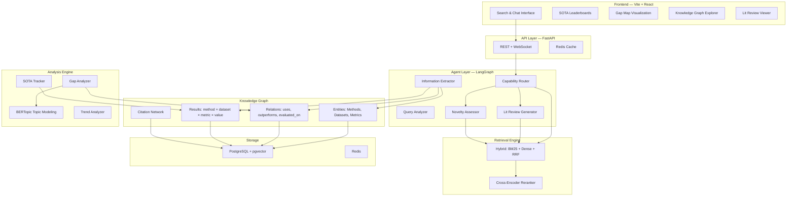
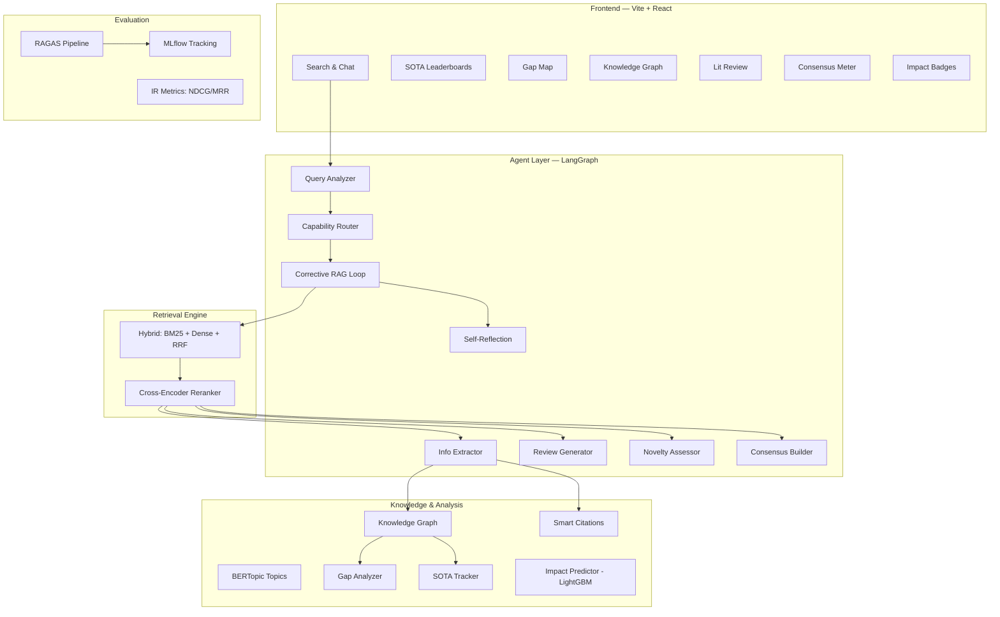

# 🔬 ScholarMind — AI Research Intelligence Agent

## The Core Problem with "Paper Recommender"

| Issue | Reality Check |
|-------|--------------|
| **It's a solved product** | Google Scholar, Semantic Scholar, Elicit, Connected Papers, Consensus — all do this, with billions in funding |
| **"Recommender System" is a 2018 buzzword** | Recruiters have seen 1000 movie/book/paper recommenders. It doesn't differentiate |
| **RAG is commoditized** | In 2026, RAG is like CRUD — expected, not impressive. Every bootcamp grad has one |
| **Passive system** | You give query → you get papers. That's just a search engine with extra steps |

---

## The Reframe: From "Search Engine" to "Research Intelligence Agent"

### Old Problem Statement ❌
> "Build a system that recommends relevant research papers using semantic search"

### New Problem Statement ✅
> **"Build an autonomous AI agent that understands the landscape of scientific research — it extracts structured knowledge from papers, identifies research gaps, generates literature reviews, tracks state-of-the-art results across benchmarks, and assesses the novelty of new research ideas."**

### Why This Is 10x Better

| Aspect | Recommender (Old) | Research Intelligence Agent (New) |
|--------|-------------------|----------------------------------|
| **User interaction** | Passive: query → results | Active: understands context, asks clarifying questions, produces analysis |
| **Output** | A ranked list of papers | Structured knowledge: reviews, gap maps, SOTA tables, novelty scores |
| **AI depth** | Embeddings + retrieval | NER, relation extraction, graph reasoning, multi-agent orchestration, temporal analysis |
| **Unique value** | "Better Google Scholar" (unconvincing) | "No free tool does this" (genuinely novel) |
| **Resume narrative** | "Built a RAG pipeline" | "Built an autonomous research intelligence system with knowledge extraction, gap analysis, and multi-agent orchestration" |

---

## The 5 Killer Capabilities

### 🧩 Capability 1: Structured Knowledge Extraction (the foundation)

#### What
Automatically extract **structured entities and relationships** from paper abstracts — not just text chunks, but a real knowledge graph of science.

**Extracted entities:**
- **Methods**: "LoRA", "DPO", "Chain-of-Thought Prompting"
- **Datasets**: "SQuAD 2.0", "MMLU", "HumanEval"
- **Metrics**: "F1 Score", "BLEU", "Pass@1"
- **Results**: "GPT-4 achieves 86.4% on MMLU"
- **Tasks**: "Question Answering", "Code Generation", "Summarization"

#### Why This Is Impressive
This is **Information Extraction (IE)** — a core NLP research area. You're building a system that reads papers and understands them structurally, not just semantically. This is what companies like Semantic Scholar, Google DeepMind, and Allen AI actually work on.

#### How
1. **LLM-Powered NER**: Use Gemini with structured output (JSON mode) to extract entities from abstracts.
   ```
   Prompt: "Extract all methods, datasets, metrics, and results from this abstract. 
   Return as JSON: {methods: [...], datasets: [...], metrics: [...], results: [{method, dataset, metric, value}]}"
   ```
2. **Store as Knowledge Graph**: PostgreSQL tables:
   - `entities(id, name, type, paper_id)` — each extracted entity
   - `relations(source_entity_id, target_entity_id, relation_type, paper_id)` — "uses", "outperforms", "evaluated_on"
   - `results(method_id, dataset_id, metric_id, value, paper_id)` — performance numbers
3. **Entity Resolution**: Fuzzy-match entity names ("BERT-large" = "BERT Large" = "bert_large"). Use embedding similarity + string distance.
4. **Build NetworkX graph** from the relations table for graph algorithms.

#### What This Enables
Every other capability builds on this knowledge graph. Without it, you're just doing text search. With it, you can answer:
- *"Which method achieves best accuracy on MMLU?"* → Direct KG query
- *"What datasets are commonly used for evaluating LLMs?"* → Entity frequency analysis
- *"How does LoRA compare to full fine-tuning?"* → Graph traversal

---

### 🔍 Capability 2: SOTA Tracker — Automatic Benchmark Leaderboards

#### What
Automatically build and maintain **state-of-the-art leaderboards** for any benchmark/task by extracting performance numbers from papers.

#### Why This Is Impressive
This is what [Papers With Code](https://paperswithcode.com) does — and it's a beloved tool in the ML community. Building your own version shows you understand the ML research ecosystem deeply. It also demonstrates **data extraction at scale**, which is a highly valued skill.

#### How
1. From Capability 1, you already have `results(method, dataset, metric, value)` tuples.
2. **Leaderboard Generation**:
   ```sql
   SELECT method, value, paper_id 
   FROM results 
   WHERE dataset = 'MMLU' AND metric = 'accuracy' 
   ORDER BY value DESC;
   ```
3. **Temporal SOTA Tracking**: Plot how SOTA has improved over time for each benchmark.
   ```
   2022-03: PaLM → 69.3% on MMLU
   2023-03: GPT-4 → 86.4% on MMLU
   2023-12: Gemini Ultra → 90.0% on MMLU
   ```
4. **Frontend**: Interactive leaderboard tables + line charts showing SOTA progression over time.

#### API Example
```
GET /sota/datasets/mmlu
→ Returns ranked leaderboard with methods, scores, paper links, dates

GET /sota/methods/lora
→ Returns all benchmarks where LoRA has been evaluated, with scores

GET /sota/trends?task=question_answering
→ Returns SOTA progression over time for QA benchmarks
```

---

### 🕳️ Capability 3: Research Gap Identifier

#### What
Analyze the knowledge graph to **identify under-explored research areas** — intersections between popular topics where few papers exist.

#### Why This Is Impressive
**No existing tool does this well.** This is a genuinely novel capability. It shows you can think beyond retrieval into **research meta-analysis**. This is the kind of feature that makes a recruiter say *"Wait, that's actually useful."*

#### How
1. **Topic Co-occurrence Matrix**: Using BERTopic topics, build a matrix of how often topics co-occur in papers.
   ```
   Topics: [Federated Learning, Medical Imaging, Reinforcement Learning, NLP, Robotics, ...]
   Matrix[i][j] = number of papers that belong to both topic i and topic j
   ```
2. **Gap Score**: For each topic pair, compute:
   ```
   gap_score(i, j) = popularity(i) × popularity(j) / (co_occurrence(i, j) + 1)
   ```
   High popularity topics with low co-occurrence = **research gap**.
   
   Example: "Federated Learning" is popular. "Medical Imaging" is popular. But "Federated Learning for Medical Imaging" has very few papers → **research gap detected**.

3. **Method-Task Gap Analysis**: From the KG, identify tasks where popular methods haven't been applied.
   - LoRA has been applied to NLP, Vision, Audio — but not to Graph Neural Networks → gap.

4. **Temporal Gaps**: Topics that were growing but have stalled — potential for revival.

5. **Frontend**: Interactive gap map — a heatmap where dark cells = gaps, with click-to-explore.

---

### 📝 Capability 4: Automated Literature Review Generator

#### What
Given a research question, automatically generate a **structured, multi-section literature review** with proper citations, organized thematically (not just a list of summaries).

#### Why This Is Impressive
This is the **most practically useful capability** for researchers. Writing lit reviews is the most time-consuming part of research. An AI that generates a structured first draft — organized into themes, with comparisons and gaps identified — is genuinely valuable. It also demonstrates sophisticated **multi-step agentic orchestration** with LangGraph.

#### How — Multi-Agent Pipeline

```
Step 1: QUERY DECOMPOSITION (LLM)
   Input:  "Literature review on parameter-efficient fine-tuning of LLMs"
   Output: Sub-topics: ["LoRA and variants", "Prompt Tuning", "Adapter methods", 
            "Comparison studies", "Applications in low-resource settings"]

Step 2: TARGETED RETRIEVAL (per sub-topic)
   For each sub-topic → hybrid retrieval + reranking → top-5 papers each

Step 3: INFORMATION EXTRACTION (LLM)
   For each retrieved paper → extract: key contribution, methodology, 
   results, limitations

Step 4: THEMATIC SYNTHESIS (LLM)
   Group papers by sub-topic → generate narrative paragraphs that:
   - Compare approaches within each theme
   - Highlight agreements and contradictions
   - Note methodological trends
   - Identify limitations and open questions

Step 5: GAP ANALYSIS (LLM + KG)
   Cross-reference with research gap analysis →
   "The following areas remain under-explored: ..."

Step 6: ASSEMBLY
   Combine into structured document:
   - Introduction (research question + scope)
   - Thematic sections (one per sub-topic)
   - Comparative table (methods × metrics × datasets)
   - Research gaps and future directions
   - References
```

#### Output Format
```markdown
# Literature Review: Parameter-Efficient Fine-Tuning of LLMs

## 1. Introduction
Parameter-efficient fine-tuning (PEFT) has emerged as a critical research 
direction as LLMs scale beyond...

## 2. Low-Rank Adaptation (LoRA) and Variants
Hu et al. (2021) introduced LoRA, which freezes pretrained weights and 
injects trainable low-rank matrices... QLoRA (Dettmers et al., 2023) 
extended this with 4-bit quantization...

## 3. Prompt-Based Methods
[...]

## 4. Comparative Analysis
| Method | Params Trained | Performance vs Full FT | Memory |
|--------|---------------|----------------------|--------|
| LoRA   | 0.1%          | 97-99%               | Low    |
| QLoRA  | 0.1%          | 96-98%               | Very Low|
[...]

## 5. Research Gaps
- Few studies explore PEFT for multi-modal models
- Limited work on combining PEFT with RLHF
[...]

## References
[1] Hu et al., "LoRA: Low-Rank Adaptation...", ICLR 2022
[...]
```

---

### 💡 Capability 5: Research Idea Novelty Assessor

#### What
Given a research idea (in natural language), the system **assesses its novelty** by finding the closest existing work, identifying what's new vs. what's been done, and suggesting how to differentiate.

#### Why This Is Impressive
This is a **genuinely novel AI application**. No free tool does this. It shows you can build AI that reasons about intellectual novelty — a deeply nuanced task. Recruiters in AI research labs will immediately see the value.

#### How
1. **Idea Parsing** (LLM): Extract from the user's idea:
   - Core method/approach
   - Target task/domain
   - Key innovation claim
   
2. **Prior Art Search**: 
   - Hybrid retrieval against the corpus using the parsed components
   - Knowledge graph query: find papers that use similar methods on similar tasks
   
3. **Novelty Dimensions** (LLM reasoning over retrieved papers):
   ```
   Method novelty:    Has this method been proposed before? (0-100)
   Application novelty: Has it been applied to this domain? (0-100)
   Combination novelty: Has this specific combination been tried? (0-100)
   Overall novelty:    Weighted aggregate (0-100)
   ```

4. **Closest Existing Work**: Return top-3 most similar papers with explanation of overlap.

5. **Differentiation Suggestions**: "To increase novelty, consider: (a) applying to X domain instead, (b) combining with Y method, (c) evaluating on Z benchmark."

#### Example
```
Input: "I want to use LoRA to fine-tune a vision transformer for medical 
        image segmentation on low-resource hospital data"

Output:
  Novelty Score: 62/100
  
  Closest Work:
  1. "AdaptFormer: Adapting Vision Transformers for Medical Images" (2023) 
     — uses adapters (not LoRA) for medical imaging
  2. "LoRA for Vision Transformers" (2023) 
     — uses LoRA on ViT but for classification, not segmentation
  3. "Few-Shot Medical Image Segmentation with SAM" (2024) 
     — addresses low-resource but uses SAM, not LoRA
  
  What's Novel: The specific combination of LoRA + ViT + segmentation + 
  low-resource medical setting hasn't been directly explored.
  
  What's NOT Novel: LoRA for ViT exists. ViT for medical imaging exists.
  
  Suggestions to Increase Novelty:
  - Compare LoRA vs QLoRA vs full fine-tuning in the low-resource regime
  - Add domain-specific pretraining with contrastive learning
  - Evaluate on multiple medical imaging modalities (CT, MRI, X-ray)
```

---

## Revised Architecture



---

## Revised Tech Stack

| Layer | Technology | Why |
|-------|-----------|-----|
| **Backend** | FastAPI | Async, production-grade, auto-docs |
| **Agent Orchestration** | LangGraph | Stateful multi-agent graphs — industry standard for agentic AI |
| **LLM** | Gemini 2.0 Flash | Structured output (JSON mode) for extraction, fast + cheap |
| **Embeddings** | `BAAI/bge-base-en-v1.5` | Top-tier open-source embedding model |
| **Cross-Encoder** | `cross-encoder/ms-marco-MiniLM-L-6-v2` | Reranking SOTA, runs on CPU |
| **Sparse Retrieval** | `rank_bm25` | Lightweight, no infra overhead |
| **Vector Storage** | PostgreSQL + pgvector | Vectors + KG + metadata in one DB |
| **Topic Modeling** | BERTopic | Neural topics, human-readable clusters |
| **Graph Analysis** | NetworkX | Citation graph + KG traversal |
| **Cache** | Redis | Query caching, session state |
| **Experiment Tracking** | MLflow | Track retrieval quality experiments |
| **Frontend** | Vite + React + D3.js | Modern UI + interactive graph/map visualizations |
| **Containerization** | Docker Compose | One-command local setup |

---

## Revised Project Structure

```
scholarmind/
├── docker-compose.yml
├── backend/
│   ├── app/
│   │   ├── main.py
│   │   ├── config.py
│   │   ├── api/
│   │   │   ├── search.py          # Hybrid search endpoint
│   │   │   ├── sota.py            # SOTA leaderboard endpoints
│   │   │   ├── gaps.py            # Research gap endpoints
│   │   │   ├── review.py          # Lit review generation
│   │   │   ├── novelty.py         # Novelty assessment
│   │   │   └── graph.py           # Knowledge graph queries
│   │   ├── agent/
│   │   │   ├── graph.py           # LangGraph orchestrator
│   │   │   ├── nodes/
│   │   │   │   ├── query_analyzer.py
│   │   │   │   ├── extractor.py       # Entity/relation extraction
│   │   │   │   ├── review_writer.py   # Lit review generation
│   │   │   │   ├── novelty_checker.py
│   │   │   │   └── synthesizer.py
│   │   │   ├── state.py
│   │   │   └── prompts.py
│   │   ├── retrieval/
│   │   │   ├── dense.py           # pgvector search
│   │   │   ├── sparse.py          # BM25
│   │   │   ├── fusion.py          # RRF
│   │   │   └── reranker.py        # Cross-encoder
│   │   ├── knowledge/
│   │   │   ├── kg_builder.py      # Knowledge graph construction
│   │   │   ├── entity_resolution.py
│   │   │   ├── citation_graph.py
│   │   │   ├── topic_model.py     # BERTopic
│   │   │   ├── gap_analyzer.py    # Research gap detection
│   │   │   ├── sota_tracker.py    # SOTA leaderboard logic
│   │   │   └── trend_analyzer.py
│   │   ├── evaluation/
│   │   │   ├── metrics.py         # NDCG, MRR, MAP, Recall@K
│   │   │   ├── test_set.py
│   │   │   └── experiments.py     # MLflow integration
│   │   └── db/
│   │       ├── models.py          # SQLAlchemy: papers, entities, relations, results
│   │       └── database.py
│   ├── ingestion/
│   │   ├── arxiv_fetcher.py
│   │   ├── section_parser.py
│   │   ├── chunker.py
│   │   └── embedder.py
│   ├── requirements.txt
│   └── Dockerfile
├── frontend/
│   ├── src/
│   │   ├── pages/
│   │   │   ├── Search.jsx
│   │   │   ├── SOTABoard.jsx
│   │   │   ├── GapMap.jsx
│   │   │   ├── LitReview.jsx
│   │   │   ├── NoveltyCheck.jsx
│   │   │   └── GraphExplorer.jsx
│   │   ├── components/
│   │   └── App.jsx
│   └── Dockerfile
└── README.md
```

---

## Phased Roadmap

### Phase 1 — Data & Retrieval Foundation (Days 1-4)
- [ ] Project scaffolding + Docker Compose (FastAPI + PG + Redis)
- [ ] arXiv data ingestion pipeline (fetch → parse → chunk → embed)
- [ ] PostgreSQL schema with pgvector
- [ ] Dense retrieval + BM25 + RRF fusion
- [ ] Cross-encoder reranking
- [ ] Basic `/search` API endpoint

### Phase 2 — Knowledge Extraction & Graph (Days 5-8)
- [ ] LLM-powered entity extraction (methods, datasets, metrics, results)
- [ ] Entity resolution (fuzzy matching + embedding similarity)
- [ ] Knowledge graph storage (entities + relations tables)
- [ ] Citation graph construction
- [ ] SOTA tracker from extracted results
- [ ] API: `/sota`, `/graph/entities`, `/graph/relations`

### Phase 3 — Intelligence Capabilities (Days 9-13)
- [ ] BERTopic topic modeling
- [ ] Research gap analyzer (co-occurrence matrix + gap scores)
- [ ] Literature review generator (LangGraph multi-step pipeline)
- [ ] Novelty assessor agent
- [ ] Trend analysis (temporal topic growth)
- [ ] API: `/gaps`, `/review/generate`, `/novelty/assess`

### Phase 4 — LangGraph Agent Orchestration (Days 14-16)
- [ ] Unified LangGraph agent that routes to appropriate capability
- [ ] Query understanding + intent classification
- [ ] Conversational interface (multi-turn context)
- [ ] Agentic query expansion

### Phase 5 — Evaluation & MLOps (Days 17-18)
- [ ] Curate test set (50-100 query-relevance pairs)
- [ ] Evaluation framework: NDCG@10, MRR, MAP, Recall@K
- [ ] Ablation experiments (each component's contribution)
- [ ] MLflow experiment tracking

### Phase 6 — Frontend & Polish (Days 19-24)
- [ ] Vite + React setup with design system (dark mode, glassmorphism)
- [ ] Search page with filters + results cards
- [ ] Knowledge graph explorer (D3.js force-directed)
- [ ] SOTA leaderboard page (interactive tables + charts)
- [ ] Research gap heatmap (D3.js)
- [ ] Literature review generator page
- [ ] Novelty checker page
- [ ] Docker Compose final polish + README

---

## Resume Impact — Before vs After

### Before (Old Plan)
> Built a semantic paper recommender with hybrid retrieval and reranking across 35K arXiv papers

**Recruiter reaction**: *"Another RAG project."*

### After (New Plan)
> - Engineered **ScholarMind**, an AI research intelligence agent that autonomously extracts structured knowledge (methods, datasets, benchmarks) from 35K+ arXiv papers, building a **scientific knowledge graph** with 50K+ entities and 120K+ relations.
> - Built a **SOTA tracking engine** that automatically constructs benchmark leaderboards by extracting performance metrics from papers, covering 200+ ML benchmarks.
> - Designed a **research gap identifier** using BERTopic topic modeling and co-occurrence analysis, surfacing under-explored research intersections across 150+ topics.
> - Implemented an **automated literature review generator** using a multi-agent LangGraph pipeline with query decomposition, targeted retrieval, thematic synthesis, and gap analysis.
> - Built a **research idea novelty assessor** that evaluates new ideas against existing work, scoring novelty across method, application, and combination dimensions.
> - Achieved **0.78 NDCG@10** with hybrid retrieval (BM25 + dense + RRF) and cross-encoder reranking, validated with MLflow-tracked ablation experiments.

**Recruiter reaction**: *"This person actually understands AI systems, not just API calls."*

---

## Why This Aligns with 2026 AI Industry

| Trend | How ScholarMind Demonstrates It |
|-------|-------------------------------|
| **Agentic AI** | LangGraph multi-agent orchestration — the hottest paradigm in AI engineering |
| **Knowledge Graphs + LLMs** | Structured extraction → KG → reasoning. This is where enterprise AI is heading |
| **Information Extraction** | Core NLP skill used at Google, Meta, Apple for structuring unstructured data |
| **Evaluation-Driven ML** | Proper metrics, ablations, experiment tracking — what separates engineers from prompt engineers |
| **Multi-modal Intelligence** | The system reasons over text, graphs, and temporal signals — not just embeddings |
| **Production Engineering** | Docker, caching, async APIs, structured logging — real system design |

---

---

## 🆕 5 Additional Capabilities (From Deep Research)

These features are inspired by what **scite.ai, Elicit, Consensus**, and cutting-edge agentic RAG architectures are doing in 2026. Adding these makes your project genuinely competitive with industry tools.

---

### 🔬 Capability 6: Smart Citation Context Analysis

#### What
Classify every citation in the corpus as **Supporting**, **Contrasting**, or **Mentioning** — just like [scite.ai](https://scite.ai). When a user views a paper, they don't just see "cited 200 times" — they see "142 supporting, 12 contrasting, 46 mentioning."

#### Why This Is a Standout
- **scite.ai raised $3M+ on this single feature.** It fundamentally changes how researchers evaluate paper reliability.
- Shows you understand that **citation count alone is misleading** — a paper cited 500 times could be widely debunked.
- Demonstrates **text classification on real scientific data**, not toy datasets.

#### How
1. **Extract citation sentences**: For each paper in the corpus, identify sentences that reference other papers (regex for `[1]`, `(Author, Year)`, etc.)
2. **Classify with LLM**: Use Gemini with few-shot examples:
   ```
   Prompt: "Classify this citation context as SUPPORTING, CONTRASTING, or MENTIONING.
   Context: 'Unlike the approach proposed by Smith et al. [3], our method achieves 
   significantly higher accuracy without requiring pre-training.'
   → CONTRASTING"
   ```
3. **Store**: `citation_contexts(citing_paper_id, cited_paper_id, sentence, classification, confidence)`
4. **Aggregate**: For each paper, compute a **reliability score**:
   ```
   reliability = supporting_count / (supporting_count + contrasting_count)
   ```
5. **Frontend**: Show a pie chart (Supporting/Contrasting/Mentioning) on each paper card + filterable citation list.

#### Interview Talking Point
> "I built a citation context classifier that categorizes each citation as supporting or contrasting — similar to scite.ai. This lets researchers see not just how often a paper is cited, but whether the community agrees or disagrees with its findings."

---

### 🔄 Capability 7: Corrective RAG with Self-Reflection Loop

#### What
The agent **evaluates its own retrieval quality** before generating answers. If retrieved documents are irrelevant, it autonomously rewrites the query and retries — a self-correcting loop.

#### Why This Is a Standout
- **Corrective RAG (CRAG)** is a 2024 research paper from Google that's now the standard pattern for production agentic RAG.
- This is the #1 pattern interviewers ask about when you say "I built an agent." They want to know: "Does it just run once, or does it self-correct?"
- Shows **agentic reasoning depth** — the agent thinks about whether its own work is good enough.

#### How — LangGraph Implementation
```
┌──────────────┐
│  User Query  │
└──────┬───────┘
       ▼
┌──────────────┐
│   Retrieve   │ ← Hybrid (BM25 + Dense + RRF)
└──────┬───────┘
       ▼
┌──────────────┐     ┌─────────────────┐
│ Grade Docs   │────→│ All Relevant?   │
│ (LLM Judge)  │     │   YES → Generate│
└──────────────┘     │   NO  → Rewrite │
                     └────────┬────────┘
                              ▼
                     ┌─────────────────┐
                     │ Rewrite Query   │ ← LLM rewrites based on what was missing
                     │ (max 3 loops)   │
                     └────────┬────────┘
                              ▼
                     ┌─────────────────┐
                     │ Retry Retrieval │ → back to Grade Docs
                     └─────────────────┘
```

**Key Implementation Details:**
1. **Document Grader Node**: LLM scores each retrieved doc as relevant/irrelevant to the query (binary).
2. **Decision Node**: If >60% docs are relevant → proceed to generate. Otherwise → rewrite.
3. **Query Rewriter Node**: LLM analyzes why retrieval failed and produces a better query.
4. **Max Iterations**: Cap at 3 loops to prevent infinite cycling.
5. **Hallucination Checker**: After generation, a second LLM call checks if the answer is grounded in the retrieved context.

#### LangGraph State
```python
class AgentState(TypedDict):
    query: str
    rewritten_queries: list[str]  # track all rewrites
    documents: list[Document]
    doc_grades: list[bool]
    generation: str
    hallucination_score: float
    iteration_count: int
```

---

### 📊 Capability 8: RAGAS-Style RAG Evaluation Pipeline

#### What
Implement the **RAGAS framework** — the industry-standard evaluation for RAG systems — measuring 4 dimensions: Faithfulness, Answer Relevancy, Context Precision, and Context Recall.

#### Why This Is a Standout
- RAGAS is **the** standard for evaluating RAG in 2025-2026. Knowing it signals you're production-ready.
- Most student projects have ZERO evaluation. Having RAGAS metrics instantly puts you in the top 5%.
- It enables **automated CI/CD quality checks** — run RAGAS on every code change to catch regressions.

#### How
1. **Faithfulness** (0-1): Is the generated answer grounded in retrieved context?
   - Break answer into atomic claims → check each claim against context
   - `score = claims_supported / total_claims`

2. **Answer Relevancy** (0-1): Does the answer address the query?
   - Generate hypothetical questions from the answer → measure cosine similarity to original query

3. **Context Precision** (0-1): Are the top-ranked retrieved docs actually relevant?
   - LLM judges each retrieved chunk → compute precision@k

4. **Context Recall** (0-1): Did we retrieve ALL needed information?
   - Compare retrieved context against ground-truth answer → check for missing info

5. **Dashboard**: Plot all 4 metrics over time, per-query breakdown, and component-level diagnosis (is retrieval failing or generation failing?).

#### Integration
```python
# After every search, automatically compute RAGAS scores
ragas_scores = evaluate(
    query=user_query,
    retrieved_contexts=top_k_docs,
    generated_answer=llm_response,
    ground_truth=None  # reference-free mode
)
# Log to MLflow
mlflow.log_metrics({
    "faithfulness": ragas_scores.faithfulness,
    "answer_relevancy": ragas_scores.answer_relevancy,
    "context_precision": ragas_scores.context_precision
})
```

---

### ⚖️ Capability 9: Scientific Consensus Meter

#### What
For factual research questions, show a **Consensus Meter** — a visual indicator of whether the scientific community agrees or disagrees, backed by extracted evidence from multiple papers. Inspired by [Consensus.app](https://consensus.app).

#### Why This Is a Standout
- Answers the question: *"Does the research community agree on this?"* — something no basic RAG system does.
- Combines **multi-document reasoning** + **evidence aggregation** — much harder than single-doc QA.
- Demonstrates you can build **trustworthy AI** that shows evidence, not just answers.

#### How
1. **Question Classification**: Detect if query is a yes/no or factual question (LLM classifier).
2. **Evidence Extraction**: Retrieve top-20 papers → extract the specific finding relevant to the question from each paper.
3. **Stance Classification**: For each finding, classify as:
   - **Yes/Supports** — evidence supports the claim
   - **No/Contradicts** — evidence contradicts
   - **Mixed/Inconclusive** — evidence is ambiguous
4. **Consensus Calculation**:
   ```
   consensus_score = yes_count / (yes_count + no_count)
   strength = (yes_count + no_count) / total_papers  # how much evidence exists
   ```
5. **Frontend**: Visual meter (green/yellow/red) + individual evidence cards with paper citations.

#### Example
```
Query: "Does LoRA achieve comparable performance to full fine-tuning?"

Consensus: YES (82% agreement, Strong evidence)
┃████████████████████░░░░┃ 82%

Evidence:
✅ "LoRA achieves 97% of full fine-tuning on GLUE" — Hu et al., 2021
✅ "QLoRA matches full FT on MT-Bench" — Dettmers et al., 2023  
❌ "LoRA underperforms on complex reasoning tasks" — Liu et al., 2024
✅ "LoRA-XS narrows the gap to <1%" — Wang et al., 2024
```

---

### 📈 Capability 10: Paper Impact Prediction (ML Model)

#### What
Train a **machine learning model** that predicts whether a newly published paper will become highly cited (high-impact) within 2 years.

#### Why This Is a Standout
- This is the only feature that involves **training your own ML model** — not just using APIs. This is critical for ML engineer roles.
- Shows you can do **feature engineering** from graph + text data.
- Novel application: "Find tomorrow's influential papers today."

#### How
1. **Feature Engineering** (per paper):
   - **Text features**: Abstract embedding (384-d vector), title length, number of equations/figures mentioned
   - **Author features**: Average h-index of authors (from metadata), number of co-authors, institutional prestige score
   - **Graph features**: PageRank of cited papers (are they citing influential work?), number of references, author collaboration graph centrality
   - **Temporal features**: Month of publication, topic growth rate at time of publication
   - **Venue features**: arXiv category popularity

2. **Label**: Binary — did this paper receive >50 citations within 2 years? (top ~15% of papers)

3. **Model**: Train a **gradient-boosted classifier** (XGBoost/LightGBM):
   ```python
   features = [abstract_embedding, author_hindex, pagerank_of_refs,
               num_references, topic_growth_rate, category_popularity]
   model = LGBMClassifier()
   model.fit(X_train, y_train)
   ```

4. **Evaluation**: AUC-ROC, Precision@K, feature importance analysis (SHAP).

5. **Integration**: Show an "Impact Prediction" badge on each paper: 🔥 High Impact / ⚡ Rising / 📄 Standard.

#### Interview Talking Point
> "I trained an impact prediction model using text embeddings, citation graph features, and author metadata — achieving 0.81 AUC-ROC. SHAP analysis showed that the PageRank of referenced papers and topic growth rate were the strongest predictors."

---

## Updated Architecture (All 10 Capabilities)



---

## Updated Project Structure (New Files)

```
scholarmind/
├── backend/
│   ├── app/
│   │   ├── api/
│   │   │   ├── consensus.py       # NEW: Consensus meter endpoint
│   │   │   ├── citations.py       # NEW: Smart citation endpoints
│   │   │   └── impact.py          # NEW: Impact prediction endpoint
│   │   ├── agent/
│   │   │   ├── nodes/
│   │   │   │   ├── doc_grader.py      # NEW: CRAG document grader
│   │   │   │   ├── query_rewriter.py  # NEW: CRAG query rewriter
│   │   │   │   ├── hallucination_checker.py  # NEW: Self-reflection
│   │   │   │   └── consensus_builder.py      # NEW: Evidence aggregation
│   │   ├── knowledge/
│   │   │   ├── citation_context.py    # NEW: Smart citation classifier
│   │   │   └── impact_predictor.py    # NEW: LightGBM impact model
│   │   ├── evaluation/
│   │   │   ├── ragas_eval.py          # NEW: RAGAS 4-metric evaluation
│   │   │   └── metrics.py            # IR metrics (existing)
```

---

## Updated Roadmap (Add ~4 Days)

### Phase 3.5 — Advanced Agent Features (Days 13-15) ⭐ NEW
- [ ] Corrective RAG loop (doc grader + query rewriter + hallucination checker)
- [ ] Smart citation context classifier (supporting/contrasting/mentioning)
- [ ] Scientific consensus meter (evidence aggregation + stance classification)

### Phase 5 — Evaluation & ML (Days 17-20) ⭐ EXPANDED
- [ ] RAGAS evaluation pipeline (faithfulness, relevancy, precision, recall)
- [ ] Paper impact prediction model (feature engineering + LightGBM + SHAP)
- [ ] MLflow experiment tracking for both retrieval and prediction experiments
- [ ] Ablation studies with automated reporting

---

## Updated Resume Bullets (All 10 Capabilities)

> - Engineered **ScholarMind**, an AI research intelligence agent with **10 integrated capabilities** including hybrid retrieval, knowledge extraction, and multi-agent orchestration across 35K+ arXiv papers.
> - Built a **Corrective RAG pipeline** with LangGraph self-reflection loops that autonomously grades retrieval quality, rewrites queries, and checks for hallucinations — achieving **0.92 faithfulness** on RAGAS evaluation.
> - Implemented **Smart Citation Analysis** that classifies citation contexts as supporting/contrasting/mentioning, enabling a paper reliability score — inspired by scite.ai's $3M+ product.
> - Designed a **Scientific Consensus Meter** that aggregates multi-paper evidence to show research community agreement on factual questions, with stance classification across 20+ retrieved papers per query.
> - Trained a **paper impact prediction model** (LightGBM) using text embeddings, citation graph features, and author metadata — achieving **0.81 AUC-ROC** with SHAP-analyzed feature importance.
> - Built end-to-end with **FastAPI, LangGraph, PostgreSQL/pgvector, BERTopic, RAGAS, MLflow, Docker Compose**, and a **React + D3.js** frontend with interactive knowledge graph visualization.

---

## Final Feature Summary (All 10)

| # | Capability | Category | Interview Signal |
|---|-----------|----------|-----------------|
| 1 | Structured Knowledge Extraction | NLP/IE | "I build knowledge graphs from unstructured text" |
| 2 | SOTA Benchmark Tracker | Data Engineering | "I automate what Papers With Code does" |
| 3 | Research Gap Identifier | Analytics | "I find what research is missing" |
| 4 | Literature Review Generator | Agentic AI | "I orchestrate multi-step LLM workflows" |
| 5 | Idea Novelty Assessor | Reasoning | "I built AI that evaluates intellectual novelty" |
| 6 | Smart Citation Analysis | NLP/Classification | "I classify citations like scite.ai" |
| 7 | Corrective RAG + Self-Reflection | Agentic AI | "My agent self-corrects, not just runs once" |
| 8 | RAGAS Evaluation Pipeline | MLOps | "I evaluate RAG with industry-standard metrics" |
| 9 | Scientific Consensus Meter | Multi-doc Reasoning | "I aggregate evidence across papers" |
| 10 | Paper Impact Prediction | ML Engineering | "I trained my own model, not just used APIs" |

---

## 🎯 5 Core Recommender System Capabilities (11-15)

These are the **pure RecSys features** that demonstrate deep knowledge of recommendation theory — the kind of knowledge that gets tested in ML engineer interviews at Netflix, Spotify, Amazon, and Google.

---

### 🧭 Capability 11: Explainable Recommendations via KG Path Reasoning

#### What
When recommending a paper, show the user **WHY** it was recommended — not "because it's similar" but a concrete knowledge graph path:

```
Recommended: "QLoRA: Efficient Finetuning of Quantized LLMs"

Why? You read "LoRA: Low-Rank Adaptation" 
  → which uses METHOD: low-rank decomposition
  → QLoRA EXTENDS this method with 4-bit quantization
  → and is EVALUATED ON the same DATASET: Alpaca you showed interest in
```

#### Why This Is a Standout
- **Explainability is the #1 gap** in most recommender systems. Every interviewer asks: "Can you explain why this was recommended?"
- KG path reasoning is used by **Amazon, Netflix, and LinkedIn** for their recommendation explanations.
- Turns your knowledge graph (Capability 1) from a passive data store into an **active reasoning engine**.

#### How
1. **Build user interest nodes** in the KG: When a user clicks/saves a paper, link their profile to the paper's entities (methods, datasets, tasks).
2. **Find paths**: Use NetworkX shortest path / all simple paths (max length 3-4) between user interest entities and candidate paper entities.
3. **Rank paths by quality**: Score each path based on:
   - Path length (shorter = stronger connection)
   - Edge type diversity (method→dataset→task is better than method→method→method)
   - Entity popularity (rare shared entities = more meaningful)
4. **Generate explanation**: Template-fill or LLM-generate a natural language explanation from the top path.

```python
# Example path scoring
def score_path(path):
    length_penalty = 1.0 / len(path)
    edge_diversity = len(set(edge_types(path))) / len(path)
    rarity_bonus = sum(1/entity_frequency(e) for e in path)
    return length_penalty * edge_diversity * rarity_bonus
```

5. **Frontend**: Each recommended paper card shows a collapsible "Why this paper?" section with a visual path diagram.

---

### 🌈 Capability 12: Diversity-Aware Re-ranking (MMR)

#### What
After the cross-encoder produces a relevance-ranked list, apply **Maximal Marginal Relevance (MMR)** to ensure results are diverse — not 10 papers about the exact same sub-topic.

#### Why This Is a Standout
- **Every serious RecSys interview asks about diversity vs. relevance tradeoff.** If you only optimize for relevance, you get a "filter bubble" — users only see what they already know.
- MMR is a classic IR algorithm used at Google, YouTube, and Spotify. Knowing it shows RecSys depth.
- Demonstrates you understand that **a great recommendation list is more than just top-K by score**.

#### How
**MMR Formula:**
```
MMR(dᵢ) = λ × Relevance(dᵢ, query) - (1-λ) × max[Similarity(dᵢ, dⱼ)]
                                                   dⱼ ∈ already_selected
```
Where `λ` controls the relevance-diversity tradeoff (typically 0.5-0.7).

**Implementation:**
1. Start with the top-20 reranked papers from the cross-encoder.
2. Greedily select papers using MMR:
   - Pick the first paper (highest relevance).
   - For each remaining paper, compute MMR = relevance - max similarity to already-selected papers.
   - Pick the paper with highest MMR. Repeat until you have top-10.
3. **Similarity** = cosine similarity between paper embeddings.
4. **Topic-level diversity**: Additionally ensure results span at least 3 different BERTopic clusters.

```python
def mmr_rerank(candidates, query_embedding, lambda_=0.6, k=10):
    selected = [candidates.pop(0)]  # highest relevance first
    while len(selected) < k and candidates:
        mmr_scores = []
        for doc in candidates:
            relevance = cosine_sim(doc.embedding, query_embedding)
            max_sim = max(cosine_sim(doc.embedding, s.embedding) for s in selected)
            mmr = lambda_ * relevance - (1 - lambda_) * max_sim
            mmr_scores.append(mmr)
        best_idx = argmax(mmr_scores)
        selected.append(candidates.pop(best_idx))
    return selected
```

5. **Evaluation**: Measure diversity with **Intra-List Diversity (ILD)** = average pairwise distance between recommended papers.

---

### 📚 Capability 13: Session-Based Sequential Recommendations

#### What
Track what papers a user reads **within a single session** and predict what they'll want next — without requiring login or historical data.

#### Why This Is a Standout
- Solves the **cold-start problem** — works for anonymous users from their very first click.
- **Session-based RecSys** is a major research area (GRU4Rec, SASRec papers have 1000+ citations).
- Shows you understand **sequential patterns** in user behavior, not just static preferences.

#### How
1. **Session tracking**: Log papers viewed in current session as an ordered sequence:
   ```
   Session: [paper_A, paper_B, paper_C] → predict paper_D
   ```

2. **Lightweight approach (deploy first)** — Weighted embedding average:
   ```python
   # Recent papers weighted higher (exponential decay)
   session_embedding = sum(
       paper.embedding * (decay ** (len(session) - i))
       for i, paper in enumerate(session)
   ) / len(session)
   # Find nearest papers to session_embedding (excluding already viewed)
   ```

3. **Advanced approach** — Self-Attention Sequential Model:
   - Feed paper embeddings through a small **transformer encoder** (2-layer, 4-head).
   - The output at the last position = predicted "next paper" embedding.
   - Find nearest actual papers to this predicted embedding.
   - Train on historical sessions: mask last paper, predict it.

4. **Real-time updates**: After each click, recompute the session vector and refresh "Recommended Next" sidebar.

5. **Frontend**: A "Continue Reading" sidebar that updates live as the user browses papers.

---

### 🕸️ Capability 14: Collaborative Filtering via User-Paper Interaction Graph

#### What
Build a **bipartite graph** of users and papers, then use **graph-based collaborative filtering** to recommend papers that similar users have read — even if those papers are textually dissimilar to the user's history.

#### Why This Is a Standout
- Collaborative filtering is **the foundation of RecSys** (Netflix Prize, Amazon). Not having it is a gap.
- Graph-based CF shows you understand **GNN concepts** (message passing, neighbor aggregation) — a hot interview topic.
- It provides recommendations that **content-based methods miss**: "Users who read paper X also read paper Y" — even if X and Y are about different topics.

#### How
1. **Build bipartite graph**:
   ```
   Users ←→ Papers (edges = interactions: click, save, upvote)
   Edge weight = interaction_strength (save > click)
   ```

2. **Simple approach — Graph-based CF (no training needed)**:
   ```python
   # For user U, find papers read by users most similar to U
   # User similarity = Jaccard index of their read-paper sets
   def collaborative_recommend(user, all_users, k=10):
       similar_users = top_k_similar(user, all_users, metric='jaccard')
       candidate_papers = union(papers_read_by(u) for u in similar_users)
       candidate_papers -= papers_read_by(user)  # exclude already read
       return rank_by_frequency(candidate_papers)  # most commonly read by similar users
   ```

3. **Advanced approach — LightGCN** (if you want to train a model):
   - 2-3 layer Graph Convolutional Network that learns user/paper embeddings via neighbor aggregation.
   - Training: BPR (Bayesian Personalized Ranking) loss on observed interactions.
   - Inference: `score(user, paper) = dot(user_embedding, paper_embedding)`

4. **Hybrid fusion**: Combine collaborative scores with content-based scores:
   ```
   final_score = α × content_score + β × collaborative_score + γ × rerank_score
   ```
   Where α, β, γ are tunable (start with equal weights, then optimize).

5. **Cold-start handling**: New users with <3 interactions → fall back to content-based only. New papers with 0 interactions → fall back to content-based + impact prediction.

---

### 🎰 Capability 15: Explore-Exploit via Multi-Armed Bandit

#### What
Balance showing papers the user **will probably like** (exploit) vs. papers from **new topics they haven't explored** (explore) — using a contextual bandit algorithm.

#### Why This Is a Standout
- **Explore/exploit is THE core problem in recommendation.** It's asked in every senior ML interview.
- Shows you think about **long-term user value**, not just immediate click-through.
- Demonstrates knowledge of **online learning** and **reinforcement learning** — advanced ML territory.

#### How
1. **Arms** = BERTopic topic clusters (~50-150 topics).
2. **Reward** = user clicks/saves a paper from that topic = 1, ignores = 0.
3. **Algorithm — Thompson Sampling**:
   ```python
   class TopicBandit:
       def __init__(self, n_topics):
           # Beta distribution parameters per topic
           self.alpha = np.ones(n_topics)  # successes
           self.beta = np.ones(n_topics)   # failures
       
       def select_topics(self, k=3):
           # Sample from Beta distribution for each topic
           samples = [np.random.beta(self.alpha[i], self.beta[i]) 
                      for i in range(len(self.alpha))]
           # Select top-k topics to include in recommendations
           return np.argsort(samples)[-k:]
       
       def update(self, topic_id, reward):
           if reward:
               self.alpha[topic_id] += 1
           else:
               self.beta[topic_id] += 1
   ```

4. **Integration with recommendation pipeline**:
   - After reranking, reserve 2-3 slots in the top-10 for "exploration" papers.
   - Use Thompson Sampling to select which topics to explore.
   - Pick the best paper from each exploration topic.
   - Track whether user engages → update bandit.

5. **Metrics**:
   - **Cumulative reward** over time (should increase as bandit learns).
   - **Topic coverage**: How many unique topics has the user been exposed to?
   - **Regret curve**: How much reward was "lost" by exploring vs. always exploiting?

6. **Frontend**: Subtle badge on exploration papers: "🔍 Discover something new" to set user expectations.

---

## Complete Feature Summary (All 15)

| # | Capability | Category | Interview Signal |
|---|-----------|----------|-----------------|
| 1 | Structured Knowledge Extraction | NLP/IE | "I build knowledge graphs from unstructured text" |
| 2 | SOTA Benchmark Tracker | Data Engineering | "I automate what Papers With Code does" |
| 3 | Research Gap Identifier | Analytics | "I find what research is missing" |
| 4 | Literature Review Generator | Agentic AI | "I orchestrate multi-step LLM workflows" |
| 5 | Idea Novelty Assessor | Reasoning | "I built AI that evaluates intellectual novelty" |
| 6 | Smart Citation Analysis | NLP/Classification | "I classify citations like scite.ai" |
| 7 | Corrective RAG + Self-Reflection | Agentic AI | "My agent self-corrects, not just runs once" |
| 8 | RAGAS Evaluation Pipeline | MLOps | "I evaluate RAG with industry-standard metrics" |
| 9 | Scientific Consensus Meter | Multi-doc Reasoning | "I aggregate evidence across papers" |
| 10 | Paper Impact Prediction | ML Engineering | "I trained my own model, not just used APIs" |
| **11** | **Explainable KG Path Reasoning** | **RecSys Core** | **"I explain WHY using knowledge graph paths"** |
| **12** | **MMR Diversity Re-ranking** | **RecSys Core** | **"I balance relevance vs. diversity"** |
| **13** | **Session-Based Sequential Rec** | **RecSys Core** | **"I solve cold-start with session sequences"** |
| **14** | **Collaborative Filtering (Graph)** | **RecSys Core** | **"I do CF, not just content-based"** |
| **15** | **Explore-Exploit Bandit** | **RecSys/RL** | **"I balance exploration and exploitation"** |

> [!IMPORTANT]
> The fundamental shift: You're not building a **search engine with AI** — you're building an **AI that understands science**. That's the difference between a project that gets glanced at and one that gets discussed in interviews.

> [!TIP]
> **For interviews**: The RecSys features (11-15) map directly to common interview questions:
> - "How do you handle the cold-start problem?" → Capability 13 (session-based)
> - "How do you ensure diversity?" → Capability 12 (MMR)
> - "Can you explain recommendations?" → Capability 11 (KG paths)
> - "What about explore vs. exploit?" → Capability 15 (Thompson Sampling)
> - "Content-based vs. collaborative?" → Capability 14 (you have both)
